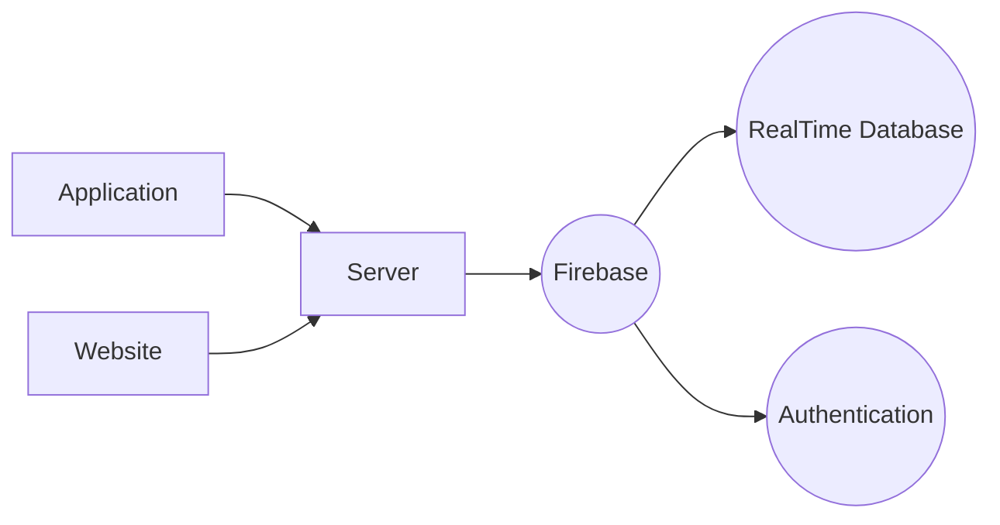

# **AREA**


[](https://github.com/Epitech-Nantes-Tek3/AREA/actions/workflows/CI.yml)

---

## **Table of Contents**

- [**AREA**](#area)
  - [**Table of Contents**](#table-of-contents)
  - [**Subject Description**](#subject-description)
  - [**Build the Project**](#build-the-project)
  - [**Graph of technical environment**](#graph-of-technical-environment)
  - [**Launch Services**](#launch-services)
  - [**Stop services**](#stop-services)
  - [**Free space**](#free-space)
  - [**Launch Tests**](#launch-tests)
  - [**Thanks for reading**](#thanks-for-reading)
  - [**Authors**](#authors)

## **Subject Description**

The goal of this project is to discover, as a whole, the software platform that you have chosen through the creation of a business application.

To do this, you must implement a software suite that functions similar to that of IFTTT and/or Zapier.

This software suite will be broken into three parts :

- [An application server](./Server/ReadMe.md)
- [A web client](./Web/ReadMe.md) to use the application from your browser by querying the application server
- [A mobile client](./Application/README.md) to use the application from your phone by querying the application server.

## **Build the Project**

To build the project, you may run the command :

```bash
docker-compose build
```

Also, do not forget to start the docker service with

```bash
systemctl start docker
```

## **Graph of technical environment**



## **Launch Services**

To launch our services (described below), you may run the command :

```bash
docker-compose up -d
```

You can also run the following command to build and launch our services:

```bash
docker-compose up --build -d
```

Our Services :

- The server service will be launched on port 8080
- The client_web service will be launched on port 8081
- The client_mobile will build the mobile client of the project

The http://localhost:8081/client.apk root should provide an APK, an Android version of the mobile client.

The http://localhost:8080/about.json root should answer with the server service.

## **Stop services**

To stop our services, you may run the command:

```bash
docker-compose down -v
```

## **Free space**

To free space on your computer after havng runned our project, you can do

```bash
docker system prune
```

**BE CAREFUL** This will remove everything related to docker on your machine !

## **Launch Tests**

Please read the following [**ReadMe**](./Application//README.md), it contains every explanations you will need.

## **Thanks for reading**

Feel free to read the `CONTRIBUTING.md`.

Do not hesitate to contact any member for any questions or remarks. You can click on each following name.

You can also find code documentation [here](https://epitech-nantes-tek3.github.io/AREA/).

## **Authors**

<table>
    <tbody>
        <tr>
            <td align="center"><a href="https://github.com/osvegn/"><br/><sub><b>Thomas Prud'homme</b></sub></a><br/></td>
            <td align="center"><a href="https://github.com/31Nathan/"><br/><sub><b>Nathan Rousseau</b></sub></a><br/></td>
            <td align="center"><a href="https://github.com/JohanCDev"><br/><sub><b>Johan Chrillesen</b></sub></a><br/></td>
            <td align="center"><a href="https://github.com/STom6"><br/><sub><b>Tom Sarrazin</b></sub></a><br/></td>
            <td align="center"><a href="https://github.com/CedricCORGE"><br/><sub><b>Cédric Corge</b></sub></a><br/></td>
        <tr>
    </tbody>
</table>
